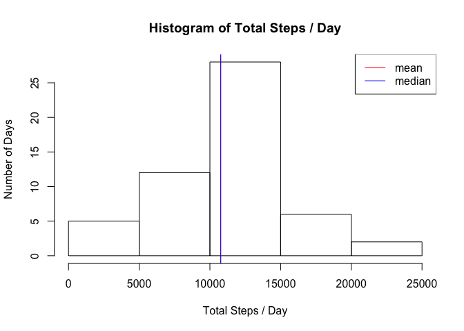
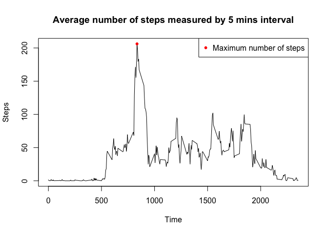
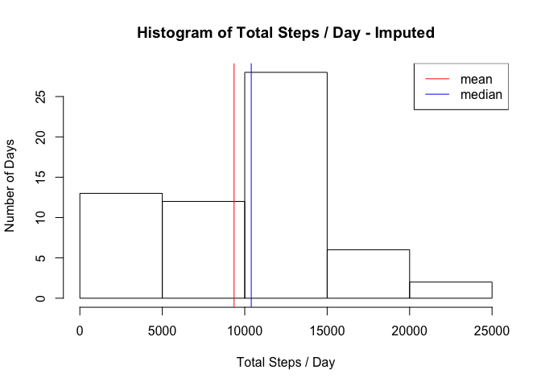
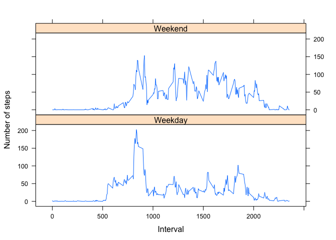

## Loading and preprocessing the data

First, let's download --in this particular project, actually, fork the repo and pull, unzip, read and investigate the data in question. 


```r
unzip("activity.zip")
dir()
```

```
##  [1] "activity_analysis.R"           "activity.csv"                 
##  [3] "activity.zip"                  "doc"                          
##  [5] "instructions_fig"              "PA1_template_files"           
##  [7] "PA1_template.html"             "PA1_template.md"              
##  [9] "PA1_template.Rmd"              "README.md"                    
## [11] "RepData_PeerAssessment1.Rproj"
```


```r
data <- read.csv("activity.csv") 
head(data)
```

```
##   steps       date interval
## 1    NA 2012-10-01        0
## 2    NA 2012-10-01        5
## 3    NA 2012-10-01       10
## 4    NA 2012-10-01       15
## 5    NA 2012-10-01       20
## 6    NA 2012-10-01       25
```

```r
str(data)
```

```
## 'data.frame':	17568 obs. of  3 variables:
##  $ steps   : int  NA NA NA NA NA NA NA NA NA NA ...
##  $ date    : Factor w/ 61 levels "2012-10-01","2012-10-02",..: 1 1 1 1 1 1 1 1 1 1 ...
##  $ interval: int  0 5 10 15 20 25 30 35 40 45 ...
```

## What is mean total number of steps taken per day?

To calculate the total steps taken per day from the data frame that has observations in 5 minites intervals, I will use the dplyr package's group_by() and summarize. 


```r
library(dplyr)

steps_per_day <- data %>%
  group_by(date) %>%
  summarize(total_steps = sum(steps))
```

Then, use the mean() and median() functions with "na.rm=TRUE" as, apparently, there are few nas in the data. I got errors withtout this argument. 


```r
mean(steps_per_day$total_steps, na.rm=TRUE)
```

```
## [1] 10766.19
```

```r
median(steps_per_day$total_steps, na.rm=TRUE)
```

```
## [1] 10765
```

Then, use the hist() function to plot a histogram. I added the mean and median calculated above as well. 


```r
hist(steps_per_day$total_steps, 
     xlab="Total Steps / Day", 
     ylab="Number of Days", 
     main="Histogram of Total Steps / Day")
abline(v=mean(steps_per_day$total_steps, na.rm=TRUE), col="red")
abline(v=median(steps_per_day$total_steps, na.rm=TRUE), col="blue")
legend("topright", legend=c("mean", "median"), col=c("red", "blue"), lty=1)
```

<!-- -->

## What is the average daily activity pattern?

To calculate the average number of steps taken at 5 minutes intervals everyday in the data frame, I will use the dplyr's group_by() and summarize() functions. The average maximum number of steps taken in a day is stored in the following variable. 


```r
steps_per_interval <- data %>%
  group_by(interval) %>%
  summarize(mean_steps = mean(steps, na.rm=TRUE))

max_steps <- steps_per_interval[which.max(steps_per_interval$mean_steps), ]
max_steps
```

```
## # A tibble: 1 x 2
##   interval mean_steps
##      <int>      <dbl>
## 1      835       206.
```

To create a line plot of the average change of number of steps taken at 5 min intervals, I used plot(). 


```r
with(steps_per_interval, plot(interval, mean_steps, type = "l", 
                              xlab = "Time", ylab="Steps", 
                              main = "Average number of steps measured by 5 mins interval"))
points(x=max_steps$interval, y=max_steps$mean_steps, pch=20, col="red")
legend("topright", legend="Maximum number of steps", col="red", pch=20)
```

<!-- -->

## Imputing missing values

First, look into where the NAs are. 


```r
sum(is.na(data))
```

```
## [1] 2304
```

```r
sum(is.na(data$steps))
```

```
## [1] 2304
```

```r
sum(is.na(data$date))
```

```
## [1] 0
```

```r
sum(is.na(data$interval))
```

```
## [1] 0
```

```r
mean(is.na(data$steps))
```

```
## [1] 0.1311475
```

```r
length(unique(data$date[which(is.na(data$steps))]))
```

```
## [1] 8
```

Per above, data$steps has about 13% NAs in its column and there are 8 days out of 61 days that has NA, which I think is fairly big to ignore. Instead of just removing them for the analysis, I will try imputing the daily average for those corresponding NAs. To do so, I will first calculate the daily average variable for all the days included in the data frame and mutate it. 


```r
data_filled <- data %>%
  group_by(date) %>%
  mutate(mean_steps = mean(steps, na.rm=TRUE))
data_filled$mean_steps[is.na(data_filled$mean_steps)] <- 0

head(data_filled)
```

```
## # A tibble: 6 x 4
## # Groups:   date [1]
##   steps date       interval mean_steps
##   <int> <fct>         <int>      <dbl>
## 1    NA 2012-10-01        0          0
## 2    NA 2012-10-01        5          0
## 3    NA 2012-10-01       10          0
## 4    NA 2012-10-01       15          0
## 5    NA 2012-10-01       20          0
## 6    NA 2012-10-01       25          0
```

Now, use this new column to replace the NAs with the corresponding daily averages using the for loop as below to create a new dataset that is equal to the original dataset but with the missing data filled in. 


```r
for (i in 1:length(data_filled$steps)) {
  if (is.na(data_filled[i, ]$steps) == TRUE) {
    data_filled[i, ]$steps <- data_filled[i, ]$mean_steps
    }
}

head(data_filled)
```

```
## # A tibble: 6 x 4
## # Groups:   date [1]
##   steps date       interval mean_steps
##   <int> <fct>         <int>      <dbl>
## 1     0 2012-10-01        0          0
## 2     0 2012-10-01        5          0
## 3     0 2012-10-01       10          0
## 4     0 2012-10-01       15          0
## 5     0 2012-10-01       20          0
## 6     0 2012-10-01       25          0
```

Calculate the mean/median of the daily steps with this new data frame. 


```r
filled_steps_per_day <- data_filled %>%
  group_by(date) %>%
  summarize(total_steps = sum(steps))

mean(filled_steps_per_day$total_steps)
```

```
## [1] 9354.23
```

```r
median(filled_steps_per_day$total_steps)
```

```
## [1] 10395
```

Plot a histgram of the daily total steps with this new data frame. 


```r
hist(filled_steps_per_day$total_steps, 
     xlab="Total Steps / Day", 
     ylab="Number of Days", 
     main="Histogram of Total Steps / Day - Imputed")
abline(v=mean(filled_steps_per_day$total_steps), col="red")
abline(v=median(filled_steps_per_day$total_steps), col="blue")
legend("topright", legend=c("mean", "median"), col=c("red", "blue"), lty=1)
```

<!-- -->

## Are there differences in activity patterns between weekdays and weekends?

To label the observations with "Weekend" and "Weekday", I used the weekdays() function and the for loop function as below. 


```r
data_filled_weekdays <- data_filled %>%
  mutate(weekday = weekdays(as.Date(date)))

for (i in 1:length(data_filled_weekdays$weekday)) {
  if (data_filled_weekdays[i, ]$weekday %in% c("Saturday", "Sunday")) {
    data_filled_weekdays[i, ]$weekday <- "Weekend"
  } else {
    data_filled_weekdays[i, ]$weekday <- "Weekday"
  }
}

data_filled_weekdays$weekday <- as.factor(data_filled_weekdays$weekday)
```

After a few internet research, I found the example image in the figure folder resembled the style of the "lattice" package. I will use xyplot() to create a line plot of the average daily activity change for wekends and weekday. 


```r
library(lattice)

steps_per_interval_filled_weekdays <- data_filled_weekdays %>%
  group_by(weekday, interval) %>%
  summarize(mean_steps = mean(steps))

xyplot(mean_steps ~ interval | weekday, 
       type="l", 
       layout = c(1, 2), 
       xlab = "Interval", 
       ylab = "Number of steps", 
       data=steps_per_interval_filled_weekdays)
```

<!-- -->

--
*end of the document*
